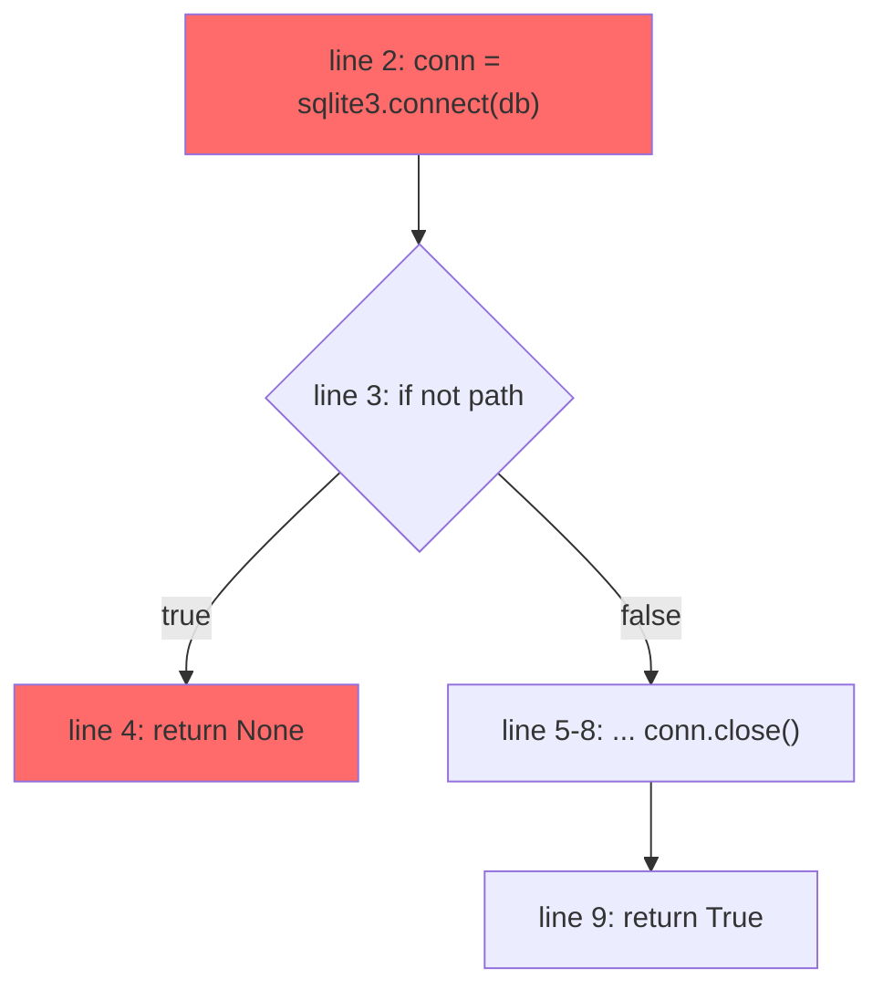

# LeakGuard

**Static resource-leak detection for Python, enforced across four points in the developer workflow.**

LeakGuard finds resources — database connections, file handles, sockets, subprocesses — that are opened on one code path and never closed on another. It does this by building a real **control-flow graph** with exception edges and running a **fixpoint dataflow analysis** over it, not by pattern-matching source text.

When it finds a leak, it doesn't say *"possible leak near line 42."* It gives you the exact path:

```
LEAK (likely) · sqlite3.Connection · app/export.py:export

  opened   line 2    conn = sqlite3.connect(db)
  path     2 → 3 → 4 (return)
  reason   reaches function exit with conn still open
  close    line 8    unreachable from line 4

  also leaks on the exception path from line 6 (f.write may raise)
```

---

## Table of contents

1. [Why this is hard](#1-why-this-is-hard)
2. [Architecture](#2-architecture)
3. [The one rule](#3-the-one-rule)
4. [Repository layout](#4-repository-layout)
5. [Step 1 — IR contract](#step-1--the-ir-contract-p1--p2-agree-this-first)
6. [Step 2 — CFG](#step-2--the-control-flow-graph)
7. [Step 3 — Escape analysis](#step-3--escape-analysis)
8. [Step 4 — Dataflow](#step-4--the-dataflow-engine)
9. [Step 5 — Exit check](#step-5--the-exit-check--where-the-leak-is-caught)
10. [Step 6 — Confidence](#step-6--confidence-scoring)
11. [Step 7 — Fingerprint & baseline](#step-7--fingerprints-and-the-baseline-ratchet)
12. [Step 8 — Reporting](#step-8--reporting)
13. [Step 9 — CLI](#step-9--the-cli)
14. [Step 10 — Interceptors](#step-10--the-four-interceptors)
15. [Step 11 — Auto-fix](#step-11--auto-fix)
16. [Step 12 — Control plane](#step-12--the-n8n-control-plane)
17. [Guardrails](#guardrails-the-false-positive-ladder)
18. [Test corpus](#test-corpus)
19. [Limitations](#known-limitations)
20. [Comparison](#comparison-with-existing-tools)
21. [Task assignment](#task-assignment)
22. [Timeline](#timeline)
23. [Git workflow](#git-workflow)
24. [Demo script](#demo-script)

---

## 1. Why this is hard

The obvious approach — walk the AST, find `open()`, check whether `.close()` appears somewhere in the same function — is wrong, and it fails on the first realistic example:

```python
def fetch(user_id):
    conn = sqlite3.connect("app.db")
    if user_id is None:
        return None                    # ← LEAK. close() below is unreachable from here.
    row = conn.execute(...).fetchone()
    conn.close()
    return row
```

Both an "open" node and a "close" node exist in that function. A syntactic checker reports it clean. It is not clean.

Same problem, different shape:

```python
def load(path):
    f = open(path)
    data = parse(f.read())     # parse() may raise
    f.close()                  # ← skipped entirely on the exception path
    return data
```

**Whether a `close()` is reachable on every path is a control-flow property, not a syntactic one.** You cannot answer it from the AST alone. You need a CFG.

The formal name for what we implement is **typestate analysis**: every resource is a state machine (`OPEN → CLOSED`), and we prove no path reaches a function exit while still in `OPEN`.

### The other half of the problem

Detection is only half the grade. The tool must not cry wolf:

```python
def get_conn():
    return sqlite3.connect(db)   # NOT a leak — the resource escapes to the caller

with open(path) as f:            # NOT a leak — context manager
    ...

self.conn = sqlite3.connect(db)  # NOT a leak — escapes to instance state
```

A tool that flags these gets uninstalled in week two. Half our engineering effort goes into the [guardrail ladder](#guardrails-the-false-positive-ladder).

---

## 2. Architecture

```
                     ┌────────────────────────────────────────┐
                     │   leakguard  (pure Python, offline)    │
                     │                                        │
   source ──────────▶│  parse → IR → CFG → dataflow → check   │──▶ findings
                     │                                        │
                     └────────────────────────────────────────┘
                                        │
        ┌───────────────┬───────────────┼───────────────┬──────────────┐
        ▼               ▼               ▼               ▼              ▼
   VS Code ext     pre-commit      GitHub Action     SARIF        JSON
   (squiggles)     (blocks         (blocks           (PR          (n8n
                    commit)         merge)            annotations) control plane)
```

**The analyzer never makes a network call.** The pre-commit hook works offline, on a plane, with no server. Source code never leaves the developer's machine. Only *findings* (file, line, resource type, fingerprint — never source) are sent to the control plane, and only from CI.

---

## 3. The one rule

> **Every surface calls one function.**

```python
def analyze(paths: list[Path], config: Config) -> list[Finding]
```

The CLI calls it. The hook calls the CLI. The Action calls the CLI. The VS Code extension calls the CLI with `--format json`. n8n consumes that same JSON.

Nothing reimplements anything. This is why four interceptors are achievable in 30 hours instead of being four projects.

**Corollary: `core/dataflow.py` must never `import ast`.** It operates only on our own IR and CFG types. This makes it unit-testable against hand-written stubs, which means P2 can start in hour 1 while P1's real lowering is still half-built.

---

## 4. Repository layout

```
leakguard/
  __init__.py
  cli.py                  # entrypoint — argparse, orchestration, exit codes
  config.py               # Config dataclass, loads .leakguard.toml

  core/
    parse.py              # source -> ast          (stdlib `ast`)
    ir.py                 # ast    -> IR events    ← P1
    cfg.py                # IR     -> CFG          ← P1  (the hard part)
    dataflow.py           # CFG    -> states       ← P2
    escape.py             # escape analysis        ← P2
    confidence.py         # DEFINITE/LIKELY/POSSIBLE
    finding.py            # Finding dataclass + fingerprint

  catalog/
    resources.yaml        # acquisition -> release pairs (user-extensible)
    loader.py

  report/
    text.py               # human-readable terminal output
    json.py               # the canonical machine format
    sarif.py              # GitHub code-scanning annotations
    mermaid.py            # CFG diagram with the leak path in red

  fix/
    rewrite.py            # Finding -> patch  (powers auto-fix AND the VS Code quick-fix)

  baseline/
    store.py              # fingerprint suppression, local file or control-plane API

tests/
  corpus/
    leaky/                # ~25 files that MUST be flagged
    safe/                 # ~25 files that MUST NOT be flagged
  test_cfg.py
  test_dataflow.py
  test_escape.py
  test_corpus.py          # runs the corpus, computes precision/recall

integrations/
  pre-commit/.pre-commit-hooks.yaml
  action/action.yml
  vscode/                 # TypeScript extension
  n8n/                    # exported workflow JSON

demo-repo/                # sample repo with 5-10 seeded leaks
docs/
  00-problem-analysis.md
  01-architecture.md
  02-decision-log.md      # dated: what we chose and WHY  ← high value for finals
  03-benchmark.md         # generated by `leakguard bench`
  04-limitations.md
  05-comparison.md
  demo-script.md
```

---

## Step 1 — The IR contract (P1 + P2 agree this FIRST)

**This is the single most important artifact in the project.** Write it in hour one, commit it, and both engine developers work in parallel against it.

```python
# core/ir.py
from dataclasses import dataclass
from typing import Literal

@dataclass(frozen=True)
class Acquire:
    var: str              # "conn"
    resource: str         # "sqlite3.Connection"
    line: int
    col: int
    snippet: str          # "conn = sqlite3.connect(db)"

@dataclass(frozen=True)
class Release:
    var: str
    line: int

@dataclass(frozen=True)
class Escape:
    var: str
    kind: Literal["return", "attribute", "container", "call_arg",
                  "global", "yield", "closure"]
    line: int
    target: str | None    # e.g. the callee name, for reporting

@dataclass(frozen=True)
class Scoped:
    """A `with` block. The resource is closed by construction at block end."""
    var: str
    resource: str
    start_line: int
    end_line: int

@dataclass(frozen=True)
class Alias:
    """b = a  — closing b closes a."""
    src: str
    dst: str
    line: int

@dataclass(frozen=True)
class CallSite:
    """Any call. Used for exception edges and interprocedural summaries."""
    callee: str
    args: tuple[str, ...]
    line: int
    may_raise: bool

Event = Acquire | Release | Escape | Scoped | Alias | CallSite
```

P1 produces `list[Event]` per basic block. P2 consumes it. Neither blocks the other.

---

## Step 2 — The control flow graph

```python
# core/cfg.py
@dataclass
class BasicBlock:
    id: int
    events: list[Event]
    line_start: int
    line_end: int

@dataclass
class Edge:
    src: int
    dst: int
    kind: Literal["normal", "true", "false", "loop_back",
                  "exception", "return", "break", "continue"]

@dataclass
class CFG:
    func_name: str
    blocks: dict[int, BasicBlock]
    edges: list[Edge]
    entry: int
    exits: list[int]      # normal returns, implicit fall-off, AND exception exits
```

### Lowering rules

Build these in order. Get each one green in `test_cfg.py` before starting the next.

| Construct | Edges to emit |
|---|---|
| straight-line statements | one block, `normal` edge to next |
| `if` / `elif` / `else` | `true` and `false` edges; both merge into a join block |
| `while` / `for` | `true` into body, `loop_back` from body end to header, `false` to exit block |
| `return` | `return` edge straight to a function exit node. **Nothing after it in that block is reachable.** |
| `break` / `continue` | edge to loop exit / loop header |
| `try` / `except` | `exception` edge from **every `CallSite` in the try body** to the handler entry |
| `try` / `finally` | every path out of the try body routes through the finally block |
| `with` | emit a `Scoped` event. Do **not** model the internal close — it's closed by construction |
| uncaught raise | `exception` edge to a dedicated exception-exit node |
| `raise` explicit | edge to enclosing handler, or exception exit |

### The exception-edge decision — read this carefully

Naively, *any* call can raise, so every call would get an exception edge to the enclosing handler or to exit. That is technically correct and practically a disaster: it makes every `try` block light up and produces exactly the noise the tool must avoid.

**Our rule:**

1. Emit exception edges from every `CallSite` where `may_raise` is true.
2. Set `may_raise = False` for calls in a known-safe list (`len`, `str`, `int`, `isinstance`, arithmetic builtins, `.append`, `.get`, …).
3. **A leak found *only* on an exception path is capped at `LIKELY`. It can never be `DEFINITE`, and therefore never blocks a build under the default `--fail-on=definite`.**

Rule 3 is the important one. It means we *report* exception-path leaks — which is what the problem statement asks for — without ever failing a build on a speculative one. Document this in `docs/02-decision-log.md`.

---

## Step 3 — Escape analysis

**This is roughly 60 lines and it will halve your false-positive rate.** Do not skip it.

If a resource leaves the function's control, we cannot conclude anything about whether it gets closed. Mark it escaped and downgrade to `POSSIBLE`.

Emit an `Escape` event when a tracked variable appears in:

| Pattern | `kind` |
|---|---|
| `return conn` | `return` |
| `self.conn = conn`, `obj.attr = conn` | `attribute` |
| `lst.append(conn)`, `d[k] = conn`, `s.add(conn)` | `container` |
| `foo(conn)` where `foo` is not a known release | `call_arg` |
| `global x` then `x = conn` | `global` |
| `yield conn` | `yield` |
| captured by a nested `def` or `lambda` | `closure` |

**Interprocedural summaries (one level, optional but high value).** Do a first pass over the module and record, per function:

- `returns_resource: bool` — does it return a tracked resource? → a call to it is an `Acquire`
- `closes_arg: set[int]` — does it call `.close()` on parameter *n*? → passing to it is a `Release`

This single pass kills the two most common real-world FP patterns:

```python
def get_conn():                    # returns_resource = True
    return sqlite3.connect(db)

def cleanup(c):                    # closes_arg = {0}
    c.close()

def work():
    c = get_conn()                 # ← recognised as an Acquire
    cleanup(c)                     # ← recognised as a Release  → no finding
```

If a callee can't be resolved, treat the argument as `call_arg` escape → `POSSIBLE`. Never guess.

---

## Step 4 — The dataflow engine

Standard forward "may" analysis with a fixpoint.

### Lattice

```
State = OPEN | CLOSED | MAYBE_OPEN | ESCAPED
```

Join at merge points:

| ⊔ | OPEN | CLOSED | MAYBE_OPEN | ESCAPED |
|---|---|---|---|---|
| **OPEN** | OPEN | MAYBE_OPEN | MAYBE_OPEN | ESCAPED |
| **CLOSED** | MAYBE_OPEN | CLOSED | MAYBE_OPEN | ESCAPED |
| **MAYBE_OPEN** | MAYBE_OPEN | MAYBE_OPEN | MAYBE_OPEN | ESCAPED |
| **ESCAPED** | ESCAPED | ESCAPED | ESCAPED | ESCAPED |

**ESCAPED dominates.** If a resource escapes on *any* path, we stop reasoning about it. This is deliberate conservatism in favour of silence.

### Transfer function

```python
def transfer(state: dict[str, State], event: Event) -> dict[str, State]:
    match event:
        case Acquire(var=v):        state[v] = OPEN
        case Release(var=v):        state[v] = CLOSED
        case Escape(var=v):         state[v] = ESCAPED
        case Scoped(var=v):         state[v] = CLOSED     # closed by construction
        case Alias(src=a, dst=b):   state[b] = state.get(a, UNKNOWN)
    return state
```

### Fixpoint

```python
def solve(cfg: CFG) -> dict[int, dict[str, State]]:
    IN  = {b: {} for b in cfg.blocks}
    OUT = {b: {} for b in cfg.blocks}
    worklist = deque([cfg.entry])

    while worklist:
        b = worklist.popleft()
        preds = [e.src for e in cfg.edges if e.dst == b]
        IN[b] = join_all(OUT[p] for p in preds) if preds else {}

        state = dict(IN[b])
        for ev in cfg.blocks[b].events:
            state = transfer(state, ev)

        if state != OUT[b]:
            OUT[b] = state
            worklist.extend(e.dst for e in cfg.edges if e.src == b)

    return OUT
```

Loops terminate because the lattice has finite height (4 states) and join is monotonic.

**Guard against pathological input:** if a function exceeds `MAX_BLOCKS` (default 500), abort its analysis, emit a `POSSIBLE` note saying the function was too complex, and move on. Never hang CI.

---

## Step 5 — The exit check — where the leak is caught

**This is the moment of detection.** Everything before it builds state; this is where "a resource is open here" becomes "this is a leak."

```python
def check_exits(cfg, OUT) -> list[LeakCandidate]:
    candidates = []
    for exit_block in cfg.exits:
        for var, state in OUT[exit_block].items():
            if state in (OPEN, MAYBE_OPEN):
                candidates.append(LeakCandidate(
                    var=var,
                    exit_block=exit_block,
                    exit_kind=exit_kind(cfg, exit_block),   # return | fallthrough | exception
                    state=state,
                    path=shortest_path(cfg, acquire_block(var), exit_block),
                ))
    return candidates
```

The `path` field is what makes the report credible — it's a **counterexample**, the way a model checker produces one. Compute it with a BFS from the acquisition block to the leaking exit.

### Worked example

```python
def export(path, db):
    conn = sqlite3.connect(db)          # 2  acquire conn
    if not path:
        return None                     # 4  exit A
    f = open(path, "w")                 # 5  acquire f
    f.write(conn.execute(q).read())     # 6  may raise -> exit C
    f.close()                           # 7
    conn.close()                        # 8
    return True                         # 9  exit B
```

| Exit | `conn` | `f` | Verdict |
|---|---|---|---|
| **A** — return line 4 | `OPEN` | not acquired | 🔴 conn leaks |
| **B** — return line 9 | `CLOSED` | `CLOSED` | ✅ clean |
| **C** — exception from line 6 | `OPEN` | `OPEN` | 🔴 both leak |

`conn` leaks on 2 of 3 exits, never escapes → **LIKELY**.

**Put this exact function in the demo.** A naive AST-walker sees `connect` and `close` in the same function and reports clean — it is precisely the "looks safe, is leaky" case the judges said they would write.

---

## Step 6 — Confidence scoring

```python
def score(var, candidates, all_exits, escaped_anywhere, exception_only) -> Confidence:
    if escaped_anywhere:
        return POSSIBLE
    if exception_only:
        return LIKELY                    # never DEFINITE — see Step 2, rule 3
    if len(candidates) == len(all_exits):
        return DEFINITE
    if candidates:
        return LIKELY
    return SAFE
```

| Level | Meaning | Default CI behaviour |
|---|---|---|
| `DEFINITE` | leaks on **every** exit, never escapes | ❌ **fails the build** |
| `LIKELY` | leaks on some exits, or exception paths only | ⚠️ warns |
| `POSSIBLE` | escapes to an unanalysed callee | ℹ️ informational |
| `SAFE` | proven closed on all paths, or context-managed | silent |

Default is `--fail-on=definite`. Teams can tighten to `likely` once they trust it.

> A pattern-matching tool cannot produce this distinction honestly. It has no notion of "all exits" because it has no exits. Say this in the pitch.

---

## Step 7 — Fingerprints and the baseline ratchet

### The adoption problem

Turn any analyzer on in an existing repo and you get hundreds of findings, so the team turns it off. This is the failure mode the problem statement explicitly warns about. The fix is a **ratchet**:

```bash
leakguard baseline          # snapshot every existing finding as accepted
leakguard check             # fails ONLY on findings not in the baseline
```

Day one is green. The count can only go down. This is how `mypy`, `ESLint`, and `Semgrep` actually get adopted in real codebases.

### Fingerprints must not use line numbers

A line-based fingerprint breaks the moment someone runs a formatter. Use content:

```python
def fingerprint(f: Finding) -> str:
    normalized = re.sub(r'\s+', ' ', f.snippet)
    normalized = re.sub(r'"[^"]*"|\'[^\']*\'', 'STR', normalized)  # literals out
    key = f"{f.rel_path}:{f.func_name}:{f.resource}:{normalized}:{f.ordinal}"
    return hashlib.sha256(key.encode()).hexdigest()[:16]
```

`ordinal` disambiguates two identical acquisitions in one function.

Baseline file — `.leakguard-baseline.json`, committed to the repo:

```json
{
  "version": 1,
  "created": "2026-09-05T10:00:00Z",
  "suppressed": [
    {"fingerprint": "a3f9c21e8b04d7f2", "reason": "legacy, tracked in JIRA-4412",
     "by": "priya", "at": "2026-09-05T10:00:00Z"}
  ]
}
```

---

## Step 8 — Reporting

### JSON — the canonical format

Every other surface consumes this. Keep it stable.

```json
{
  "version": "1.0",
  "summary": {"definite": 2, "likely": 3, "possible": 1, "files_scanned": 47,
              "duration_ms": 412},
  "findings": [
    {
      "fingerprint": "a3f9c21e8b04d7f2",
      "confidence": "definite",
      "resource": "sqlite3.Connection",
      "file": "app/export.py",
      "function": "export",
      "variable": "conn",
      "acquired_at": {"line": 2, "col": 4, "snippet": "conn = sqlite3.connect(db)"},
      "leak_path": [
        {"line": 2, "note": "conn opened here"},
        {"line": 3, "note": "branch taken"},
        {"line": 4, "note": "return — exits with conn still open"}
      ],
      "close_found_at": [8],
      "close_unreachable_from": 4,
      "exit_kind": "return",
      "reason": "reaches function exit with conn still open; close() at line 8 is unreachable from line 4",
      "fix_available": true,
      "severity": "high"
    }
  ]
}
```

### SARIF

Emit SARIF 2.1.0 and GitHub renders findings as **inline annotations on the PR diff**. Roughly 40 lines of code for a large amount of perceived polish. Upload with `github/codeql-action/upload-sarif@v3`.

### Mermaid — the demo asset

`leakguard explain app/export.py:export` emits the CFG with the leaking path in red:



**Build this.** It is the one visual no competing team can produce, because producing it requires actually having a CFG. It goes on the final slide.

---

## Step 9 — The CLI

```bash
leakguard check [PATHS]        # analyze; non-zero exit if findings >= --fail-on
leakguard bench                # run the corpus, print the confusion matrix
leakguard baseline             # snapshot current findings as accepted
leakguard explain FILE:FUNC    # Mermaid CFG with the leak path highlighted
leakguard fix [PATHS] --write  # apply auto-fix patches
```

Flags for `check`:

| Flag | Default | Purpose |
|---|---|---|
| `--format` | `text` | `text` \| `json` \| `sarif` |
| `--fail-on` | `definite` | `definite` \| `likely` \| `possible` \| `never` |
| `--diff-only` | off | analyze only functions touched by the git diff |
| `--baseline` | `.leakguard-baseline.json` | suppression file |
| `--config` | `.leakguard.toml` | config file |
| `--jobs` | cpu_count | parallel workers |

### Exit codes — the CI contract

| Code | Meaning |
|---|---|
| `0` | clean, or all findings below threshold |
| `1` | **findings at or above `--fail-on`** — this is what blocks the build |
| `2` | tool error (parse failure, bad config) |

**Deliberate asymmetry:** the tool **fails closed on findings** (a confident leak blocks the build) but **fails open on itself** (an internal crash exits `2`, and CI is configured to treat `2` as a warning). A security gate that bricks CI when it meets syntax it doesn't understand gets uninstalled the same afternoon. Mention this in Q&A — it demonstrates product judgment.

---

## Step 10 — The four interceptors

| # | Interceptor | Fires | Latency | Enforcement |
|---|---|---|---|---|
| 1 | VS Code extension | as you type / on save | ~50ms | none — squiggle + quick-fix |
| 2 | Pre-commit hook | before the commit exists | <1s, offline | **blocks the commit** |
| 3 | GitHub Action | on push / PR | seconds | **blocks the merge** |
| 4 | n8n control plane | after CI reports | async | triage, track, patch |

### 10a — Pre-commit hook

`integrations/pre-commit/.pre-commit-hooks.yaml`:

```yaml
- id: leakguard
  name: LeakGuard resource-leak check
  entry: leakguard check
  language: python
  types: [python]
  pass_filenames: true
```

Consumers add to their `.pre-commit-config.yaml`:

```yaml
repos:
  - repo: https://github.com/<org>/leakguard
    rev: v0.1.0
    hooks:
      - id: leakguard
```

### 10b — GitHub Action

`integrations/action/action.yml`:

```yaml
name: LeakGuard
description: Static resource-leak detection
inputs:
  paths:      { default: "." }
  fail-on:    { default: "definite" }
  diff-only:  { default: "true" }
runs:
  using: composite
  steps:
    - run: pip install leakguard
      shell: bash
    - run: |
        leakguard check ${{ inputs.paths }} \
          --fail-on ${{ inputs.fail-on }} \
          --format sarif > leakguard.sarif
      shell: bash
    - uses: github/codeql-action/upload-sarif@v3
      with: { sarif_file: leakguard.sarif }
```

**The demo money shot is a real PR with a red ❌ and a blocked merge.** Set up branch protection on `demo-repo` requiring the LeakGuard check to pass.

### 10c — VS Code extension

Do **not** build a Language Server. ~120 lines of TypeScript:

```
on save (debounced 300ms)
  → child_process.exec("leakguard check --format json <file>")
  → JSON.parse
  → vscode.languages.createDiagnosticCollection → squiggles
  → CodeActionProvider → 💡 "Wrap in with-statement"  (calls fix/rewrite.py)
```

Scaffold with `yo code`. Because the CLI already emits JSON, the extension is a *thin client* — this is the payoff of the one-function rule.

---

## Step 11 — Auto-fix

`fix/rewrite.py` takes a `Finding` and returns a patch. **One module, three surfaces:** `leakguard fix --write`, the VS Code quick-fix lightbulb, and the n8n PR bot.

Scope it to exactly two safe transformations:

**Case 1 — hoist into a `with` block** (only when the resource does not escape and the acquisition dominates all uses):

```python
# before
f = open(path)
data = f.read()
f.close()

# after
with open(path) as f:
    data = f.read()
```

**Case 2 — wrap in `try/finally`** (everything else that is still fixable):

```python
conn = sqlite3.connect(db)
try:
    ...
finally:
    conn.close()
```

Anything outside these two cases: set `fix_available: false` and offer nothing. Being honest about what you won't fix is worth more than a patch that breaks someone's code.

Use `ast.unparse()` for generation and `ast.get_source_segment()` for extracting the original range.

**Verification rule:** after generating any patch, re-run `analyze()` on the patched source. If the finding is not gone, discard the patch silently. Never surface an unverified fix.

---

## Step 12 — The n8n control plane

**Strictly additive. The analyzer works fully with this switched off.** This layer never sees source code — only findings.

| Workflow | Trigger | Does |
|---|---|---|
| `ingest-findings` | webhook from CI | dedupe by fingerprint → Postgres |
| `pr-comment` | after ingest | posts the witness path as a PR comment with triage buttons |
| `triage-callback` | webhook from the buttons | records **real leak** / **false positive** + reason → updates shared baseline |
| `slack-alert` | on `DEFINITE` | notifies the channel |
| `fix-bot` | on `fix_available` | LLM drafts patch → **re-run analyzer to verify** → open PR only if clean |
| `weekly-digest` | schedule | leak-debt trend report |

### Why this isn't decoration

The problem statement's core tension is *"gets disabled by week two."* The triage loop is a direct, demonstrable answer:

1. LeakGuard flags something in a PR
2. n8n posts it with **Real leak** / **False positive** buttons
3. Dev clicks *False positive* + reason
4. n8n writes that fingerprint to the **shared** baseline, with attribution
5. Next CI run: gone, team-wide, with an audit trail
6. Dashboard shows measured FP rate declining

Every other team will *claim* a false-positive rate. We demonstrate a system that measurably improves — with **zero ML**, fully deterministic, which keeps the "AST-based, not guessing" thesis intact.

A baseline in a local JSON file is a toy. A baseline in a control plane, with attribution and history, is a product.

### Framing — get this right

Never say *"our backend is n8n."* Say:

> *"The analyzer is a self-contained, offline Python package. The team-scale control plane is orchestrated in n8n."*

If judges think the analysis runs in n8n, the technical argument is lost before it starts.

---

## Guardrails: the false-positive ladder

Ten rungs between a code pattern and a failed build.

| # | Guardrail | Kills |
|---|---|---|
| 1 | Catalog allowlist | anything not a known resource type |
| 2 | `with` / context-manager recognition | the #1 naive false positive |
| 3 | `try/finally` recognition | close-in-finally |
| 4 | `contextlib.closing` / `ExitStack` | wrapper idioms |
| 5 | Alias tracking | `b = a; b.close()` |
| 6 | **Escape analysis** | `return conn`, `self.conn = conn`, `list.append(conn)` |
| 7 | Interprocedural summaries | `get_conn()` and `cleanup(c)` helpers |
| 8 | Confidence threshold | uncertain findings warn instead of blocking |
| 9 | **Baseline ratchet** | every pre-existing leak in a legacy repo |
| 10 | `# leakguard: ignore[reason]` + triage loop | the long tail, with an audit trail |

Rungs **6** and **9** do the most work. Rung 6 is ~60 lines. Rung 9 is what makes the tool installable on day one in a repo with 400 existing leaks.

### Resource catalogue

`catalog/resources.yaml` — user-extensible, so "what about *my* library?" has a good answer:

```yaml
resources:
  - id: sqlite3.Connection
    acquire: ["sqlite3.connect"]
    release: ["close"]
    context_manager: true
    severity: high
    scarcity: pooled          # pooled resources rank above unpooled

  - id: builtins.file
    acquire: ["open", "io.open", "codecs.open"]
    release: ["close"]
    context_manager: true
    severity: medium
    scarcity: fd

  - id: socket.socket
    acquire: ["socket.socket", "socket.create_connection"]
    release: ["close", "shutdown"]
    context_manager: true
    severity: high
    scarcity: fd
```

Ship ~25 built-ins: `sqlite3`, `psycopg2`, `pymysql`, `open`, `socket`, `subprocess.Popen`, `tempfile.NamedTemporaryFile`, `requests.Session`, `urllib.request.urlopen`, `zipfile.ZipFile`, `tarfile.open`, `threading.Lock`, `multiprocessing.Pool`, `shelve.open`, …

---

## Test corpus

**P4 writes these in hours 0–10, before the engine exists.** They are the specification. The engine is done when they all pass.

### `tests/corpus/safe/` — MUST NOT be flagged

```python
with open(p) as f: ...                    # context manager
with contextlib.closing(urlopen(u)): ...  # closing() wrapper
try:    f = open(p)
finally: f.close()                        # close in finally
def get(): return sqlite3.connect(db)     # escapes via return
self.conn = sqlite3.connect(db)           # escapes to instance attr
conns.append(sqlite3.connect(db))         # escapes into a collection
a = open(p); b = a; b.close()             # closed through an alias
stack.enter_context(open(p))              # ExitStack
c = get_conn(); cleanup(c)                # interprocedural summaries
if x: f = open(p); f.close()
else: f = open(q); f.close()              # closed on both branches
```

### `tests/corpus/leaky/` — MUST be flagged

```python
f = open(p)
if bad: return                            # early return past the close
f.close()

for p in paths:
    f = open(p)                           # opened N times
f.close()                                 # closed once

f = open(p)
risky()                                   # may raise
f.close()                                 # skipped on exception path

try:    f = open(p); use(f)
except: f.close()                         # closed ONLY on the error path

f = open(a)
f = open(b)                               # first handle overwritten and lost
f.close()

conn = connect()
with open(p) as fh:                       # the `with` is a decoy
    return fh.read()                      # conn leaks
```

That last one is the trap a judge will write. Make sure it passes.

### Benchmark output

```
$ leakguard bench

              flagged   clean
    leaky        TP 23   FN  1
    safe         FP  2   TN 24

    precision 0.92   recall 0.96   F1 0.94
```

One command, live on stage, real numbers. Regenerate `docs/03-benchmark.md` from it.

---

## Known limitations

**Document these before a judge finds them.** The problem statement explicitly says a documented edge case is more credible than an undocumented false negative discovered live.

| Limitation | Behaviour | Why |
|---|---|---|
| Resources stored in object attributes | `POSSIBLE`, not flagged | Requires whole-program analysis of object lifetime |
| Resources passed to unresolved callees | `POSSIBLE`, not flagged | No cross-module summaries in the MVP |
| Dynamic dispatch (`getattr(obj, name)()`) | not tracked | Undecidable statically |
| Resources closed in `__del__` | not recognised | Non-deterministic in CPython |
| Async context managers (`async with`) | recognised as safe; `await`-only paths not modelled | Time |
| Multi-file interprocedural | single-module only | Time |
| Conditionally-mutually-exclusive branches | may report `LIKELY` where a human sees safety | Path-insensitive join — deliberate, see decision log |
| Functions > 500 basic blocks | analysis aborted, `POSSIBLE` note | Prevents pathological CI hangs |

The last row is worth calling out in Q&A: we chose **path-insensitive dataflow with a join lattice** over full path enumeration because the latter is exponential on nested conditionals. We accept precision loss on mutually-exclusive branches in exchange for bounded, predictable runtime. That trade-off, stated plainly, reads as engineering maturity.

---

## Comparison with existing tools

Do **not** claim to beat CodeQL. Claim a different point on the curve.

| Tool | What it does | Where it falls short here |
|---|---|---|
| **Pylint** `R1732` | Suggests `with` when it sees a bare `open()` | Style heuristic, no CFG. Cannot say *which path* leaks; noisy on safe code |
| **flake8 / bugbear** | Lint patterns | No dataflow at all |
| **Semgrep** (OSS) | Pattern match + limited taint | Pattern-based; early returns and exception paths out of reach |
| **SonarQube** S2095 | Genuine path-sensitive leak detection | **Our strongest competitor.** Closed-source engine, heavy install, no lightweight pre-commit story, doesn't show its reasoning |
| **CodeQL** | Very powerful leak queries | Requires a database build; minutes not seconds. Cannot run in a pre-commit hook |
| **Infer** (Meta) | Strong leak analysis | Java/C/ObjC — effectively no Python |

**Our position:**

> *We are not more powerful than CodeQL. We are the one you can run on every commit in under a second, that shows its work, and that won't get switched off in week two.*

Volunteering that SonarQube and CodeQL are genuinely stronger on raw analysis power earns far more credibility than claiming to beat everything. Judges will have heard "ours is better than all of them" eight times by then.

---

## Task assignment

| Who | Lane | Owns |
|---|---|---|
| **P1** | Engine — frontend | `core/parse.py`, `core/ir.py`, `core/cfg.py` |
| **P2** | Engine — analysis | `core/dataflow.py`, `core/escape.py`, `core/confidence.py`, `fix/rewrite.py` |
| **P3** | Delivery + control plane | `cli.py`, `report/*`, pre-commit, Action, SARIF, n8n, dashboard |
| **P4** | Evidence + story | test corpus, benchmark harness, `demo-repo/`, `docs/`, slides |

**P1 takes the CFG — it is the critical path.** Give it to whoever is strongest on graph algorithms.

**P4 is not a soft role.** That person writes the failing test cases *first*, which turns the build into TDD and means the FP/FN numbers are real rather than retrofitted at hour 29.

**P3 ships the graded deliverable by hour 8**, then builds the differentiator. Everything after hour 8 is upside that can be dropped without failing the brief.

---

## Timeline

| Hours | Milestone | Who |
|---|---|---|
| 0–2 | Repo, branches, CI skeleton. **IR contract agreed and committed.** Corpus started. | all |
| 2–8 | Dumbest end-to-end path: parse → find unclosed → exit 1. **Hook + Action live.** | P3 |
| 4–12 | CFG with exception edges | P1 |
| 8–16 | Dataflow + escape + confidence | P2 |
| 8–20 | n8n control plane, PR comments, triage loop | P3 |
| 16–20 | `fix/rewrite.py` | P2 |
| **18** | 🚦 **GO/NO-GO GATE** | all |
| 20–24 | VS Code extension · Mermaid CFG viz · dashboard | P3 + P4 |
| 24–27 | Benchmark numbers, `LIMITATIONS.md`, demo repo finalised | P4 |
| 27–30 | **Freeze.** Slides, rehearse, **record backup demo video.** | all |

### 🚦 The hour-18 gate

Ask one question: **does the engine correctly handle early returns, exception paths, and escape analysis?**

- **Yes** → proceed to stretch goals.
- **No** → **cut the n8n layer and the frontend. All four people onto the core.**

A polished control plane wrapped around a broken analyzer loses to a plain CLI that is actually correct. Write this gate into `docs/02-decision-log.md` now, while everyone is calm and rested.

---

## Git workflow

- `main` is protected. Nobody pushes to it directly.
- Feature branches: `feat/cfg-builder`, `feat/dataflow`, `feat/github-action`, `feat/corpus`
- PRs into `main`, one teammate reviews. **The review comments are themselves evidence of collaboration** — organisers are watching the repo.
- Conventional commits: `feat:`, `fix:`, `docs:`, `test:`, `refactor:`
- **Commit small and often.** A monitored repo with four commits at hour 29 looks bad regardless of code quality.
- Every merge to `main` must keep CI green.

### `docs/02-decision-log.md`

The highest-value document for the final round. Dated entries, one per non-obvious choice:

```markdown
## Hour 9 — path-insensitive dataflow
Chose a join lattice over full path enumeration. Full enumeration is exponential
on nested conditionals and would blow the CI latency budget. Accepted: precision
loss on mutually-exclusive branches. Mitigated by capping those to LIKELY so they
never block a build.

## Hour 11 — exception-path leaks capped at LIKELY
Any call can raise, so modelling every call's exception edge as DEFINITE would
flag most try blocks — exactly the noise the problem statement warns about.
Exception-only leaks are reported but never block.
```

When a judge asks *"why did you do X?"*, having a timestamped answer is what separates a project from a prototype.

---

## Demo script

Rehearse this. Time it. Record a backup video at hour 28.

1. `leakguard check demo-repo/` → catches the early return **and** the exception path
2. **Hand the judge a keyboard.** They write `with open(...)` → clean. `return conn` → clean. Close-after-early-return → caught.
3. `leakguard explain` → CFG diagram, leak path in red
4. Real PR on `demo-repo` → red ❌ → merge blocked
5. VS Code: 💡 → one click → fixed
6. `leakguard bench` → the confusion matrix, real numbers
7. Dev clicks *false positive* in the PR → dashboard FP rate drops live
8. `leakguard baseline` on a legacy repo → 400 findings → CI green, ratchet engaged

**Closing line:**

> *Caught in the editor. Blocked at the commit. Enforced in CI. Tracked across the team. One engine, four interceptors — and it gets quieter every week instead of louder.*

---

## Quick start

```bash
python -m venv .venv && source .venv/bin/activate   # Windows: .venv\Scripts\activate
pip install -e ".[dev]"
pytest                      # engine unit tests
leakguard check demo-repo/  # should exit 1 with findings
leakguard bench             # precision / recall on the corpus
```
